# Jarkom-Modul-2-ITB07-2022
Laporan Resmi Pengerjaan Soal Shift Praktikum Jaringan Komputer

Kelompok ITB07: <br>
5027201004 Alda Risma Harjian <br>
5027201042 Ilham Muhammad Sakti <br>
5027201067 Naufal Ramadhan <br>

## Soal:

Twilight (〈黄昏 (たそがれ) 〉, <Tasogare>) adalah seorang mata-mata yang berasal dari negara Westalis. Demi menjaga perdamaian antara Westalis dengan Ostania, Twilight dengan nama samaran Loid Forger (ロイド・フォージャー, Roido Fōjā) di bawah organisasi WISE menjalankan operasinya di negara Ostania dengan cara melakukan spionase, sabotase, penyadapan dan kemungkinan pembunuhan. Berikut adalah peta dari negara Ostania:

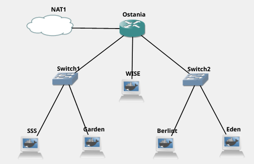

## Soal 1:
WISE akan dijadikan sebagai DNS Master, Berlint akan dijadikan DNS Slave, dan Eden akan digunakan sebagai Web Server. Terdapat 2 Client yaitu SSS, dan Garden. Semua node terhubung pada router Ostania, sehingga dapat mengakses internet.

### Jawaban Soal 1:
Kami membuat topologi terlebih dahulu sebagai berikut:

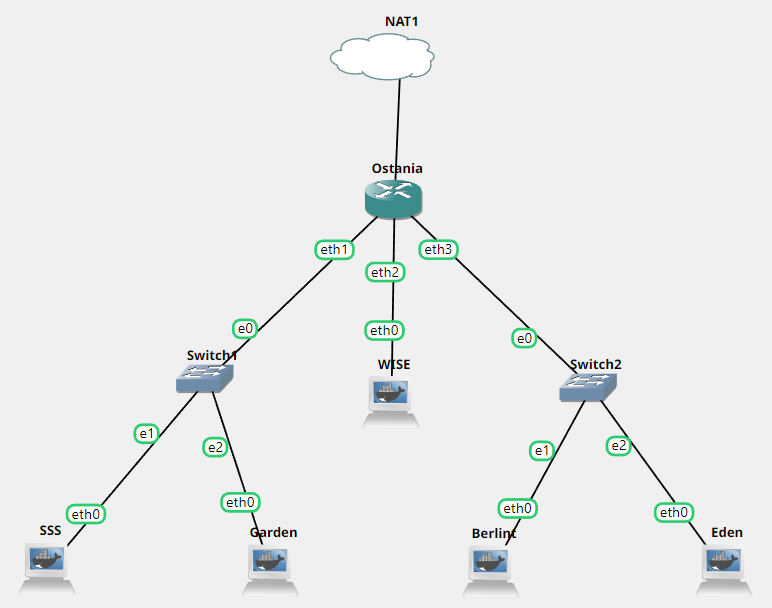

Lalu, kami melakukan konfigurasi jaringan pada setiap node seperti berikut:

**Ostania sebagai router**
```
iptables -t nat -A POSTROUTING -o eth0 -j MASQUERADE -s 10.48.0.0/16
```

Network configuration for Ostania

```
auto eth0
iface eth0 inet dhcp

auto eth1
iface eth1 inet static
	address 10.48.1.1
	netmask 255.255.255.0

auto eth2
iface eth2 inet static
	address 10.48.2.1
	netmask 255.255.255.0

auto eth3
iface eth3 inet static
	address 10.48.3.1
	netmask 255.255.255.0

```

**WISE sebagai DNS Master**

```
echo "nameserver 192.168.122.1" > /etc/resolv.conf

apt-get update  
apt-get install bind9 -y
```
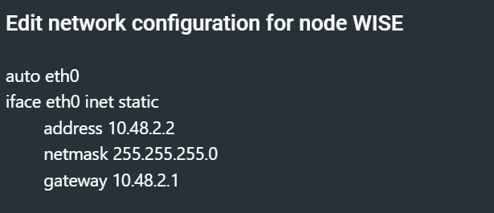

**Berlint sebagai DNS Slave**
```
echo "nameserver 192.168.122.1" > /etc/resolv.conf
apt-get update
apt-get install bind9 -y 
```
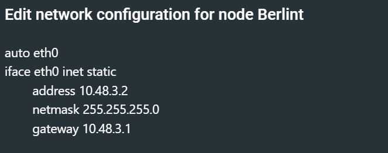

**Eden sebagai Web Server**
```
echo "nameserver 192.168.122.1" > /etc/resolv.conf
apt-get update
```
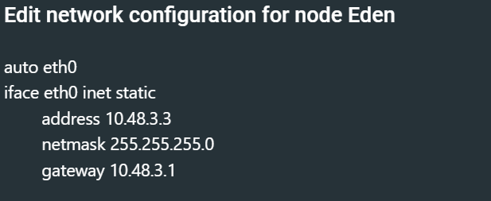

**SSS sebagai client**
```
echo 'nameserver 192.168.122.1' > /etc/resolv.conf

apt-get update         
apt-get install dnsutils -y
```
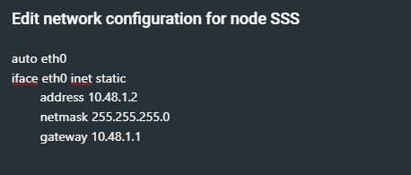

**Garden sebagai client**
```
echo 'nameserver 192.168.122.1' > /etc/resolv.conf
```
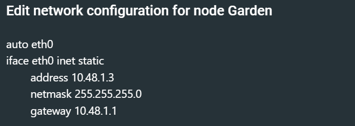


## Soal 2:
Untuk mempermudah mendapatkan informasi mengenai misi dari Handler, bantulah Loid membuat website utama dengan akses wise.yyy.com dengan alias www.wise.yyy.com pada folder wise

### Jawaban Soal 2:
**Server WISE** <br>
Melakukan konfigurasi terhadap file `/etc/bind/named.conf.local` dengan menambahkan
```
zone "wise.ITB07.com" {  
        type master;  
        file "/etc/bind/wise/wise.ITB07.com";
};
```
Membuat direktori baru yaitu `/etc/bind/wise` <br>
Menambahkan konfigurasi pada `/etc/bind/wise/wise.ITB07.com` <br>
```
$TTL    604800  
@       IN      SOA     wise.ITB07.com. root.wise.ITB07.com. (
                        2021100401      ; Serial
                        604800          ; Refresh
                        86400           ; Retry
                        2419200         ; Expire
                        604800 )        ; Negative Cache TTL
;
@               IN      NS      wise.ITB07.com.
@               IN      A       10.48.2.2 ; IP WISE
www             IN      CNAME   wise.ITB07.com.
```
Melakukan restart service bind9 dengan `service bind9 restart`.

**Server SSS**
```
apt-get install dnsutils -y  
echo "nameserver 10.48.2.2 > /etc/resolv.conf
```

**TESTING**

#1 ping wise.ITB07.com <br>
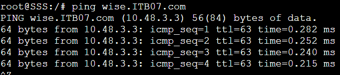 <br>
#2 ping www.wise.ITB07.com <br>
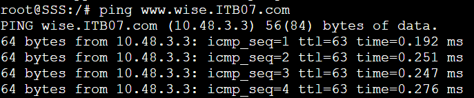 <br>
#3 host -t CNAME www.wise.ITB07.com <br>
 <br>

## Soal 3:
Setelah itu ia juga ingin membuat subdomain eden.wise.yyy.com dengan alias www.eden.wise.yyy.com yang diatur DNS-nya di WISE dan mengarah ke Eden 

### Jawaban Soal 3:
**Server WISE**<br>

Melakukan Edit pada file `/etc/bind/wise/wise.ITB07.com` menjadi seperti berikut:
```
$TTL    604800  
@       IN      SOA     wise.ITB07.com. root.wise.ITB07.com. (  
                        2021100401      ; Serial
                        604800          ; Refresh
                        86400           ; Retry
                        2419200         ; Expire
                        604800 )        ; Negative Cache TTL
;
@               IN      NS      wise.ITB07.com.
@               IN      A       10.48.2.2 ; IP WISE
www             IN      CNAME   wise.ITB07.com.
eden            IN      A       10.48.3.3 ; IP Eden
www.eden        IN      CNAME   eden.wise.ITB07.com.
```
Melakukan restart sevice bind9 dengan `service bind9 restart`.

**TESTING**

#1 ping eden.wise.ITB07.com <br>
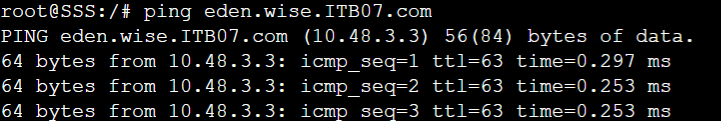 <br>
#2 ping www.eden.wise.ITB07.com <br>
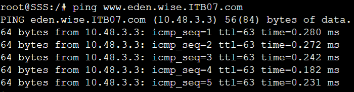 <br>
#3 host -t A eden.wise.ITB07.com <br>
 <br>
#4 host -t CNAME www.eden.wise.ITB07.com <br>
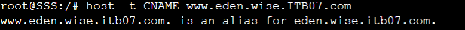 <br>

## Soal 4:
Buat juga reverse domain untuk domain utama

### Jawaban Soal 4:
**Server WISE** <br>

Edit file `/etc/bind/named.conf.local` menjadi sebagai berikut:
```
zone "wise.ITB07.com" {  
        type master;  
        file "/etc/bind/wise/wise.ITB07.com";  
};

zone "2.48.10.in-addr.arpa" {
        type master;
        file "/etc/bind/wise/2.48.10.in-addr.arpa";
};
```
dan lakukan konfigurasi pada file `/etc/bind/wise/2.48.10.in-addr.arpa` seperti berikut ini:
```
$TTL    604800  
@       IN      SOA     wise.ITB07.com. root.wise.ITB07.com. (
                        2021100401      ; Serial
                        604800          ; Refresh
                        86400         ; Retry
                        2419200         ; Expire
                        604800 )       ; Negative Cache TTL
;
2.48.10.in-addr.arpa.   IN      NS      wise.ITB07.com.
2                       IN      PTR     wise.ITB07.com.
```
Melakukan restart sevice bind9 dengan `service bind9 restart`.

**TESTING**

#1 host -t PTR 10.48.2.2 <br>
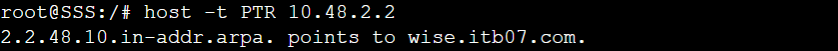 <br>

## Soal 5
Agar dapat tetap dihubungi jika server WISE bermasalah, buatlah juga Berlint sebagai DNS Slave untuk domain utama 

### Jawaban Soal 5
**Server WISE** <br>

lakukan konfigurasi pada file `/etc/bind/named.conf.local` sebagai berikut untuk melakukan konfigurasi DNS Slave yang mengarah ke Berlint:
```
zone "wise.ITB07.com" {
        type master;
        notify yes;
        also-notify {10.48.3.2;}; //IP Berlint
        allow-transfer  {10.48.3.2;}; //ip berlint
        file "/etc/bind/wise/wise.ITB07.com";
};

zone "2.48.10.in-addr.arpa" {
        type master;
        file "/etc/bind/wise/2.48.10.in-addr.arpa";
};
```
Melakukan restart sevice bind9 dengan `service bind9 restart`

**Server Berlint** 
```
zone "wise.ITB07.com" {
        type slave;
        masters { 10.48.2.2; }; // Masukan IP wise tanpa tanda petik
        file "/var/lib/bind/wise.ITB07.com";
};
```
Melakukan restart sevice bind9 dengan `service bind9 restart`

**TESTING**

#1 Melakukan stop service bind9 di WISE <br>
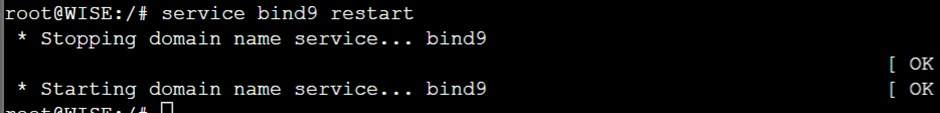 <br>

#2 Melakukan ping dengan server SSS <br>
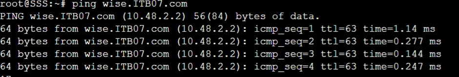 <br>

## Soal 6
Karena banyak informasi dari Handler, buatlah subdomain yang khusus untuk operation yaitu operation.wise.yyy.com dengan alias www.operation.wise.yyy.com yang didelegasikan dari WISE ke Berlint dengan IP menuju ke Eden dalam folder operation 

### Jawaban Soal 6
**Server WISE** <br>

Melakukan konfigurasi pada /etc/bind/wise/wise.ITB07.com
```
$TTL    604800
@       IN      SOA     wise.ITB07.com. root.wise.ITB07.com. (
                        2021100401      ; Serial
                        604800          ; Refresh
                        86400           ; Retry
                        2419200         ; Expire
                        604800 )        ; Negative Cache TTL
;
@               IN      NS      wise.ITB07.com.
@               IN      A       10.48.3.3 ; IP eden
www             IN      CNAME   wise.ITB07.com.
eden            IN      A       10.48.3.3 ; IP eden
www.eden        IN      CNAME   eden.wise.ITB07.com.
ns1             IN      A       10.48.3.2 ; ip berlint
operation       IN      NS      ns1
```
Kemudian edit file `/etc/bind/named.conf.options` dan comment `dnssec-validation auto;` dan tambahkan baris berikut pada `/etc/bind/named.conf.options`
```
allow-query{any;};  
```
Kemudian edit file `/etc/bind/named.conf.local` menjadi seperti:
```
zone "wise.ITB07.com" {
        type master;
        //notify yes;
        //also-notify {10.48.3.2;}; //IP Berlint
        allow-transfer  {10.48.3.2;}; //ip berlint
        file "/etc/bind/wise/wise.ITB07.com";
};

zone "2.48.10.in-addr.arpa" {
        type master;
        file "/etc/bind/wise/2.48.10.in-addr.arpa";
};
```

Melakukan restart sevice bind9 dengan `service bind9 restart`

**Server Berlint** <br>
Edit file `/etc/bind/named.conf.options` dan comment `dnssec-validation auto;` dan tambahkan baris berikut pada `/etc/bind/named.conf.options` 
``` 
allow-query{any;}; 
```
kemudian edit file `/etc/bind/named.conf.local` untuk delegasi `operation.wise.yyy.com` 
``` zone "wise.ITB07.com" {
        type slave;
        masters { 10.48.2.2; }; // Masukan IP wise tanpa tanda petik
        file "/var/lib/bind/wise.ITB07.com";
};

zone "operation.wise.ITB07.com"{
        type master;
        file "/etc/bind/operation/operation.wise.ITB07.com";
};
```
buat sebuah direktori `mkdir /etc/bind/operation` dan lakukan konfigurasi pada file `/etc/bind/operation/operation.wise.ITB07.com`
```
$TTL    604800
@       IN      SOA     operation.wise.ITB07.com. root.operation.wise.ITB07.com. (
                       2021100401      ; Serial
                        604800         ; Refresh
                        86400         ; Retry
                        2419200         ; Expire
                        604800 )       ; Negative Cache TTL
;
@               IN      NS      operation.wise.ITB07.com.
@               IN      A       10.48.3.3       ;ip eden
www             IN      CNAME   operation.wise.ITB07.com.
```
Melakukan restart sevice bind9 dengan `service bind9 restart`

**TESTING**

#1 Melakukan testing ping operation.wise.ITB07.com dan www.operartion.wise.ITB07.com<br>
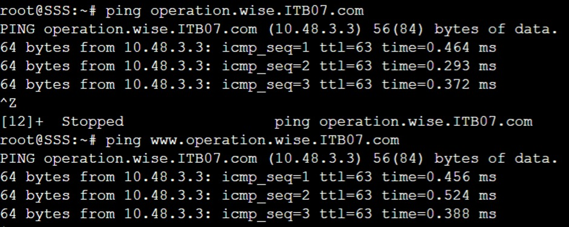 <br>

## Soal 7
Untuk informasi yang lebih spesifik mengenai Operation Strix, buatlah subdomain melalui Berlint dengan akses strix.operation.wise.yyy.com dengan alias www.strix.operation.wise.yyy.com yang mengarah ke Eden 

### Jawaban Soal 7
**Server Berlint** <br>
konfigurasi file `/etc/bind/operation/operation.wise.ITB07.com` dengan
```
$TTL    604800
@       IN      SOA     operation.wise.ITB07.com. root.operation.wise.ITB07.com. (       
                        2021100401      ; Serial
                        604800         ; Refresh
                        86400         ; Retry
                        2419200         ; Expire
                        604800 )       ; Negative Cache TTL
;
@               IN      NS      operation.wise.ITB07.com.
@               IN      A       10.48.3.3       ;ip eden
www             IN      CNAME   operation.wise.ITB07.com.
strix           IN      A       10.48.3.3       ;ip eden
www.strix       IN      CNAME   operation.wise.ITB07.com.
```
Melakukan restart sevice bind9 dengan `service bind9 restart`

**TESTING**

#1 Melakukan testing seperti pada gambar dibawah ini <br>
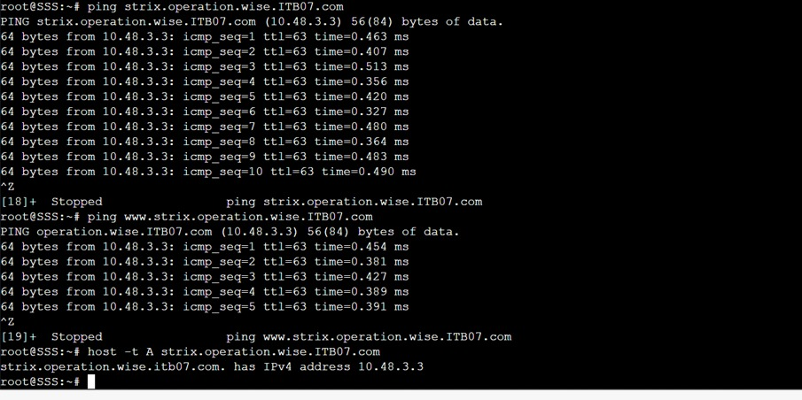 <br>

## Soal 8
Setelah melakukan konfigurasi server, maka dilakukan konfigurasi Webserver. Pertama dengan webserver www.wise.yyy.com. Pertama, Loid membutuhkan webserver dengan DocumentRoot pada /var/www/wise.yyy.com 

### Jawaban Soal 8
**Server SSS** <br>
Melakukan `apt-get update` dan menginstall lynx dengan cara
```
apt-get update
apt-get install lynx -y
```
**Server Eden** <br>
Melakukan instalasi Apache, php, openssl untuk melakukan download ke website https dengan cara
```
apt-get install apache2 -y
service apache2 start
apt-get install php -y
apt-get install libapache2-mod-php7.0 -y
service apache2 
apt-get install ca-certificates openssl -y
```
konfigurasi file `/etc/apache2/sites-available/wise.ITB07.com.conf`. Lalu melakukan DcumentRoot diletakkan di /var/www/wise.ITB07.com. Jangan lupa untuk menambah servername dan serveralias
```
<VirtualHost *:80>

        ServerAdmin webmaster@localhost
        DocumentRoot /var/www/wise.ITB07.com
        ServerName wise.ITB07.com
        ServerAlias www.wise.ITB07.com
</VirtualHost>
```
Lalu lakukan membaut sebuah direkroti root untuk server wise.ITB07.com dan melakukan copy file content
```
apt install wget -y
wget --no-check-certificate 'https://docs.google.com/uc?export=download&id=1S0XhL9ViYN7TyCj2W66BNEXQD2AAAw2e' -O /root/wise.zip
unzip /root/wise.zip -d /root
cp -r /root/wise/. /var/www/wise.ITB07.com
service apache2 restart
```
**TESTING**

#1 Melakukan testing pada lynx wise.ITB07.com dan lynx www.wise.ITB07.com <br>
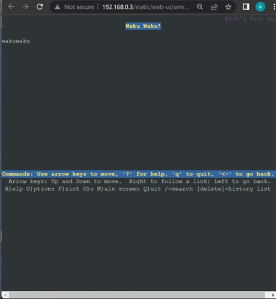 <br>
	
## Soal 9
Setelah itu, Loid juga membutuhkan agar url `www.wise.yyy.com/index.php/home` dapat menjadi menjadi `www.wise.yyy.com/home`

### Jawaban Soal 9
**Server Eden** <br>
konfigurasi file `/var/www/wise.ITB07.com/.htaccess` dengan
```
a2enmod rewrite
service apache2 restart
echo "
RewriteEngine On
RewriteCond %{REQUEST_FILENAME} !-f
RewriteCond %{REQUEST_FILENAME} !-d
RewriteRule (.*) /index.php/\$1 [L]
```

Inti dari konfigurasi tersebut adalah kita melakukan cek apakah request tersebut adalah ke file atau bukan dan ke direktori atau bukan jika hal tersebut terpenuhi aka kita membuat rule untuk melakukan direct ke /index.php/home. $1 merupakan parameter yang diinputkan di url konfigurasi file `/etc/apache2/sites-available/wise.ITB07.com.conf` dengan
```
<VirtualHost *:80>
        ServerAdmin webmaster@localhost
        DocumentRoot /var/www/wise.ITB07.com
        ServerName wise.t07.com
        ServerAlias www.wise.ITB07.com

        ErrorLog \${APACHE_LOG_DIR}/error.log
        CustomLog \${APACHE_LOG_DIR}/access.log combined

        <Directory /var/www/wise.ITB07.com>
                Options +FollowSymLinks -Multiviews
                AllowOverride All
        </Directory>
</VirtualHost>
```

Melakukan restart service apache2 dengan `service apache2 restart`

## Testing
Kemudian melakukan testing dengan menggunakan <br> `lynx www.wise.ITB07.com/home` <br>
 <br>

## Soal 10
Setelah itu, pada subdomain `www.eden.wise.yyy.com`, Loid membutuhkan penyimpanan aset yang memiliki DocumentRoot pada /var/www/eden.wise.yyy.com

### Jawaban Soal 10
**Server Eden** <br>
konfigurasi file `/etc/apache2/sites-available/eden.wise.ITB07.com.conf` dengan
```
<VirtualHost *:80>

        ServerAdmin webmaster@localhost
        DocumentRoot /var/www/eden.wise.ITB07.com
        ServerName eden.wise.ITB07.com
        ServerAlias www.eden.wise.ITB07.com

        ErrorLog \${APACHE_LOG_DIR}/error.log
        CustomLog \${APACHE_LOG_DIR}/access.log combined

        <Directory /var/www/wise.ITB07.com>
                Options +FollowSymLinks -Multiviews
                AllowOverride All
        </Directory>
</VirtualHost>
```
Lalu aktifkan virtualhost dengan a2ensite, membuat direktori untuk documentroot di /var/www/eden.wise.ITB07.com dan jangan lupa untuk melakukan copy content ke documentroot dengan cara
```
a2ensite eden.wise.ITB07.com
mkdir /var/www/eden.wise.ITB07.com
cp -r /root/eden.wise/. /var/www/eden.wise.ITB07.com
service apache2 restart
```
konfigurasi file `/var/www/eden.wise.ITB07.com/index.php` dengan `echo "<?php echo 'yes nomor 10' ?>"`

## Testing
Untuk membuktikan bahwa kita sudah membuat sebuah file index.php. Maka kita dapat melakukan testing lynx `www.eden.wise.ITB07.com` <br>
 <br>

## Soal 11
Akan tetapi, pada folder `/public`, Loid ingin hanya dapat melakukan directory listing saja

### Jawaban Soal 11
**Server Eden** <br>
konfigurasi file `/etc/apache2/sites-available/eden.wise.ITB07.com.conf` menamahkan Options +Indexes ke direktori yang ingin di directory list dengan
```
<VirtualHost *:80>

        ServerAdmin webmaster@localhost
        DocumentRoot /var/www/eden.wise.ITB07.com
        ServerName eden.wise.ITB07.com
        ServerAlias www.eden.wise.ITB07.com

        <Directory /var/www/eden.wise.ITB07.com/public>
                Options +Indexes
        </Directory>


        <Directory /var/www/wise.ITB07.com>
                Options +FollowSymLinks -Multiviews
                AllowOverride All
        </Directory>
</VirtualHost>
```
Kemudian melakukan `service apache2 restart`

## Testing
Melakukan testing pada server client dengan menggunakan <br>
`lynx www.eden.wise.ITB07.com/public` <br>
 <br>

## Soal 12
Tidak hanya itu, Loid juga ingin menyiapkan error file 404.html pada folder /error untuk mengganti error kode pada apache

### Jawaban Soal 12
**Server Eden** <br>
konfigurasi file `/etc/apache2/sites-available/eden.wise.ITB07.com.conf` menambahkan konfigurasi ErrorDocumentuntuk setiap error yang ada yang diarahkan ke file /error/404.html dengan
```
<VirtualHost *:80>

        ServerAdmin webmaster@localhost
        DocumentRoot /var/www/eden.wise.ITB07.com
        ServerName eden.wise.ITB07.com
        ServerAlias www.eden.wise.ITB07.com

        ErrorDocument 404 /error/404.html
        ErrorDocument 500 /error/404.html
        ErrorDocument 502 /error/404.html
        ErrorDocument 503 /error/404.html
        ErrorDocument 504 /error/404.html

        <Directory /var/www/eden.wise.ITB07.com/public>
                Options +Indexes
        </Directory>


        <Directory /var/www/wise.ITB07.com>
                Options +FollowSymLinks -Multiviews
                AllowOverride All
        </Directory>
</VirtualHost>
```
Kemudian lakukan `service apache2 restart`

## Testing
Kemudian melakukan testing pada web client <br>
`lynx www.eden.wise.ITB07.com/HOHOHO` <br>
 <br>

## Soal 13
Loid juga meminta Franky untuk dibuatkan konfigurasi virtual host. Virtual host ini bertujuan untuk dapat mengakses file asset `www.eden.wise.yyy.com/public/js` menjadi `www.eden.wise.yyy.com/js`

### Jawaban Soal 13
**Server Eden** <br>
konfigurasi file `/etc/apache2/sites-available/eden.wise.ITB07.com.conf` menambahkan konfigurasi Alias dengan
```
<VirtualHost *:80>

        ServerAdmin webmaster@localhost
        DocumentRoot /var/www/eden.wise.ITB07.com
        ServerName eden.wise.t07.com
        ServerAlias www.eden.wise.t07.com

        ErrorDocument 404 /error/404.html
        ErrorDocument 500 /error/404.html
        ErrorDocument 502 /error/404.html
        ErrorDocument 503 /error/404.html
        ErrorDocument 504 /error/404.html

        <Directory /var/www/eden.wise.ITB07.com/public>
                Options +Indexes
        </Directory>

        Alias \"/js\" \"/var/www/eden.wise.ITB07.com/public/js\"


        ErrorLog \${APACHE_LOG_DIR}/error.log
        CustomLog \${APACHE_LOG_DIR}/access.log combined

        <Directory /var/www/wise.ITB07.com>
                Options +FollowSymLinks -Multiviews
                AllowOverride All
        </Directory>
</VirtualHost>
```
Kemudian melakukan `service apache2 restart`

## Testing
`lynx www.eden.wise.ITB07.com/js`
